class: center, middle, inverse

```{r setup, include=FALSE, message=FALSE}
options(htmltools.dir.version = FALSE)
#library(mapview)
#library(lakemorpho)
#library(elevatr)
#data(lake)
#data(pt_df)
```

# Twitter?


### hashtag: \#cyanobacteria
### me: @jhollist


---
class: center, middle, inverse

# Who, what, why, and how?


---

# Who are we?

.left-column[
- Ecologists 
- Computational focus
  - Enough to be dangerous
- 3 FTE
  - Myself
  - Betty Kreakie
  - Bryan Milstead
- 2 Post-docs
  - Farnaz Nojavan
  - Stephen Shivers
]

.right-column[
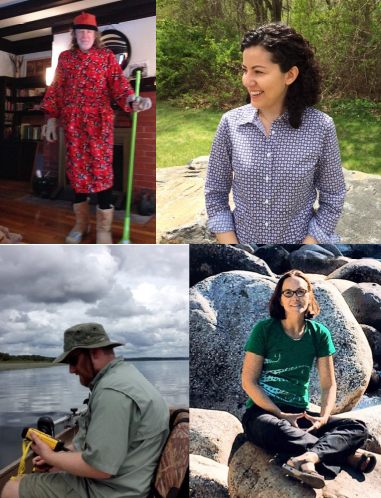</img>
]


---

# What do we do? 

- Apply computational approaches to understand water quality impacts in lakes
- Open Science


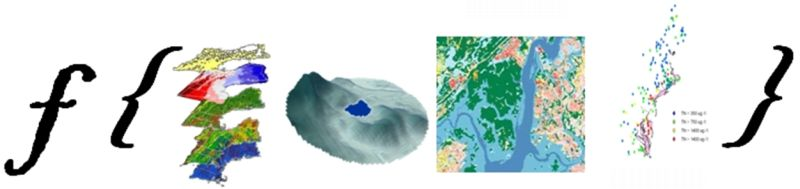


---

# What is open science? 

- Access to materials     
- Reproducible/ Repeatable    
- The Web!                   
- A process, not a state                       

</img>


---

# Why open science?


- Often required
  - Government/Funders/Journals
- Benefits researchers
  - [Mciernan et al. (2016) How open science helps researchers succeed](https://elifesciences.org/content/5/e16800)
- Improves quality
  - [The classic example: Reinhart and Rogoff](http://www.newyorker.com/news/john-cassidy/the-reinhart-and-rogoff-controversy-a-summing-up)
- Benefits to society
  - ["Sharing of Data Leads to Progress on Alzheimer’s"](http://www.nytimes.com/2010/08/13/health/research/13alzheimer.html)

</img>


---

# How are we open?

.left-column[

- R package development
    - Research compendia
    - Tooling for common problems
- Visualization
- Sharing and collaborating
- Publishing
- Apply to our research efforts 
]

.right-column[
</img>
]

---
class: center, middle, inverse

# R Packages

---

# Why R Packages

- Useful structure
- Infrastructure for sharing
  - GitHub
  - CRAN
- We are an R shop!

</img>

---
# Research Compendia

.left-column[
- Define
- Origins
  - [Gentleman and Lang (2004)](http://biostats.bepress.com/bioconductor/paper2)
- Part of
  - Reproducible Research
  - Literate Programming (ala Donald Knuth)
- ROpenSci efforts
  - [rrrpkg](https://github.com/ropensci/rrrpkg)
  - [ROpenSci unconf 2017 discussion](https://github.com/ropensci/unconf17/issues/5)
]

.right-column[

</img>

from Nüst, Konkol, et al (2017), https://doi.org/10.1045/january2017-nuest
]

---

# Packages as Research Compendia
- R, Data, and Vignettes folders
- Other examples  
    - [Carl Boettiger's template](https://github.com/cboettig/template)
    - [Ben Marwick](https://github.com/benmarwick/Pleistocene-aged-stone-artefacts-from-Jerimalai--East-Timor)
- Our examples
    - https://github.com/usepa/LakeTrophicModelling
    - https://github.com/usepa/Microcystinchla)
- GitHub and Zenodo (Archive)

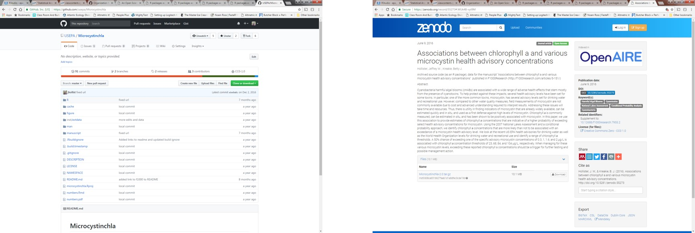

---

# Packages to solve common problems
  - `lakemorpho`
  - `elevatr`
  - `goatscape` (in development)
  
</img>
---

# `lakemorpho`

.footnote[Package URL: <https://cran.r-project.org/package=lakemorpho>]

.left-column[
- Lake morphometry metrics in R
- Version 1.0 
  - August 2014
- Version 1.1.0 
  - December 2016
- `sf` support to be added
- [National Lake Morphometry](https://edg.epa.gov/metadata/catalog/search/resource/details.page?uuid=%7B495CBAED-9BB9-49B4-80A7-1C91DE5FCA95%7D)
- [Hollister and Milstead (2010)](http://dx.doi.org/10.1080/07438141.2010.504321)
- [Hollister *et. al.* (2011)](http://dx.doi.org/10.1371/journal.pone.0025764)
- [Hollister and Stachelek (2017)](https://f1000research.com/articles/6-1718/v1)
]

.right-column[
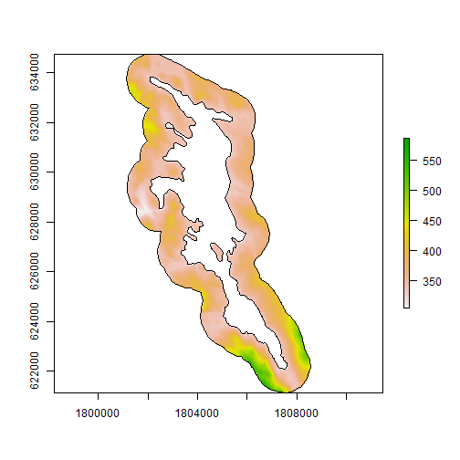
]


---
class: center, middle
background-image: url('figure/lakemorpho_demo.png')
background-position: 50% 50%

# lakemorpho::demo

<!-- # [lakemorpho: Demo](http://server.jwhollister.com:8787) -->


---

# `elevatr`

.footnote[Package URL: <https://cran.r-project.org/package=elevatr>]

.left-column[
- Access elevation data in R
  - Mapzen
  - AWS
  - USGS
- Version 0.1.1 
  - January 2017
- Version 0.1.3 
  - March 2017
- Will be paired with `lakemorpho`
- `sf` support to be added
]

.right-column[

]


---
class: center, middle
background-image: url('figure/elevatr_demo.png')
background-position: 50% 50%

# elevatr::demo

<!-- # [elevatr: Demo](http://server.jwhollister.com:8787) -->

---

# `goatscape`

.left-column[
- New effort with Bryan Milstead
- What's in a name?
- Summarizes ancillary data for a user-defined landscape polygon
  - Census (via `censusapi`)
  - Landcover
  - Impervious
- Accepts arbitrary spatial data for the landscape
- Based on `sf` and tidy by design
- <https://github.com/usepa/goatscape>
]

.right-column[
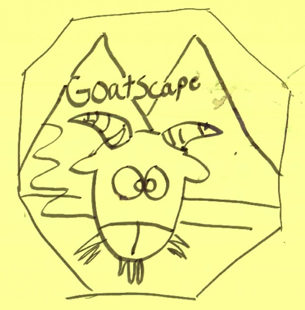</img>
]
---

class: middle, center, inverse

# Data Visualization


---

# Shiny: Cyanobacteria Monitoring Collaborative

.footnote[Project URL: <http://cyanos.org>]

.left-column[
- Started in 2013
  - New England Region Cyanobacteria Monitoring Workgroup
- Three Projects
  - bloomWatch
  - cyanoScope
  - Monitoring
- Data Viz with Shiny
]

.right-column[
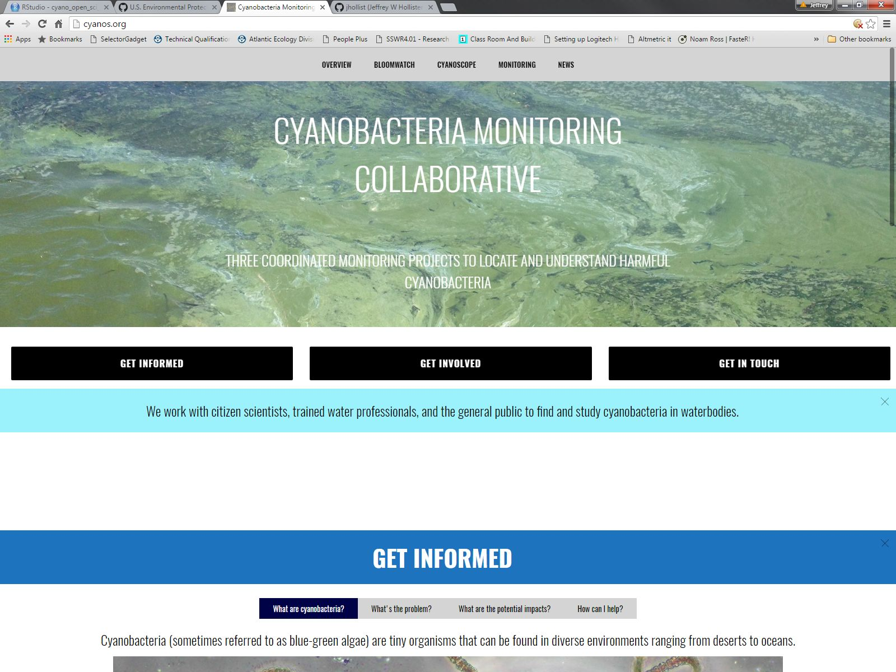
]


---
class: middle, center
background-image: url("figure/shiny.jpg")

# [Shiny: Demo](https://cyanos.shinyapps.io/cyanoviz/)


---
class: middle, center, inverse

#  Sharing and Collaborating


---

# GitHub

- What is it?
- How do we use it?


</img>


---
class: middle, center
background-image: url("figure/github_demo.jpg")

# [GitHub: Demo](https://github.com/usepa)


---
class: middle, center, inverse

#  Open Access


---

# Publishing

- Preprints
  - [Hollister *el al.* (2016) PeerJ Preprints](http://dx.doi.org/10.7287/peerj.preprints.1319v2)
- Open first
  - [Milstead *et al.* (2013) PLoS One](http://dx.doi.org/10.1371/journal.pone.0081457)
  - [Hollister and Kreakie (2016) F1000Research](https://dx.doi.org/10.12688/f1000research.7955.2)
- Money where our mouth(s) is(are)
  - [Kreakie *et al.* (2015) LakeLines](http://www.nalms.org/media.acux/beb75c9c-f812-4753-b888-79864899c6d6)

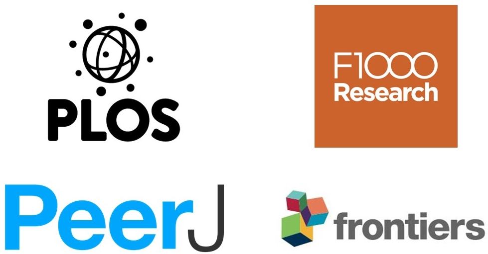</img>


---
class: middle, center, inverse

#  Open Science Research


---

# Models and field research

- Random forest models of trophic state and chlorophyll *a*
- Re-thinking the Lake Trophic State Index
- Chlorophyll *a* and microcystin
- Temporal and spatial dynamics of cyanobacteria blooms
- New work
    - Lake photic zone temperature
    - Phytoplankton community analysis

</img>

---

# Random forest models of trophic state and chlorophyll *a*

.left-column[
- National 
- Data
    - National Lakes Assessment
    - Land cover
- `randomForest` package
- Variable selection
- All variables (water quality and GIS) 
    - 68.7% Total Accuracy
- GIS only variables 
    - 49% Total Accuracy
- But ...]

.right-column[
</img>
]

---

# Random forest models of trophic state and chlorophyll *a*

- How is it open and reproducible?
    - [GitHub](https://github.com/usepa/LakeTrophicModelling)
    - [10.5281/zenodo.40271](http://dx.doi.org/10.5281/zenodo.40271)
    - [PeerJ Pre-print](https://peerj.com/preprints/1319/)
    - [Ecosphere (OA)](http://onlinelibrary.wiley.com/doi/10.1002/ecs2.1321/full)

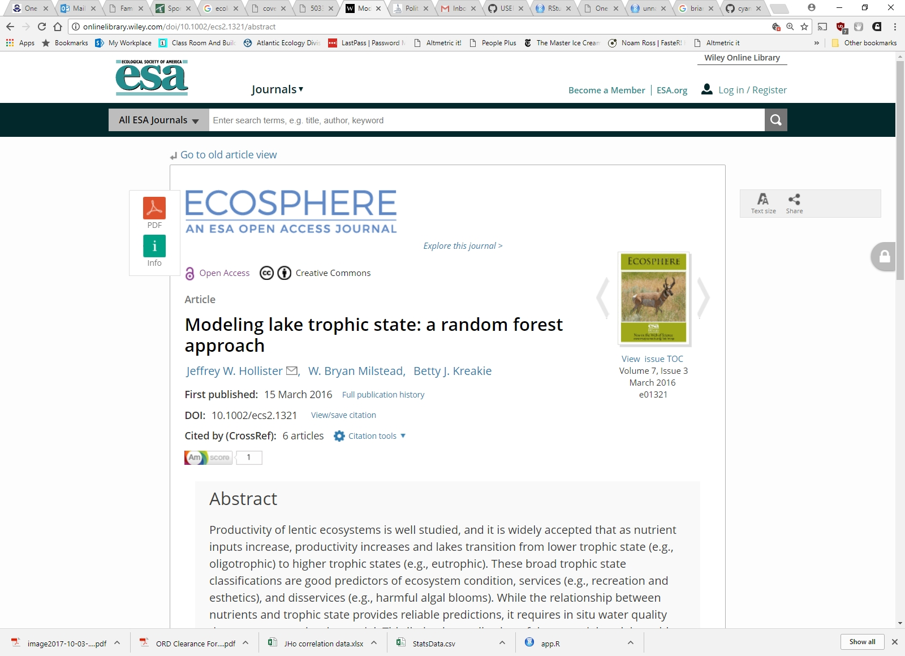
---

# Re-thinking the Lake Trophic State Index

.left-column[
- Led by Farnaz Nojavan
- Hierarchical model
  - Nitrogen and Phosphorus
  - POLR: Revised Trophic State Index
- Total Accuracy 
  - 0.6
- Balanced Accuracy
  - 0.68 to 0.78
]

.right-column[
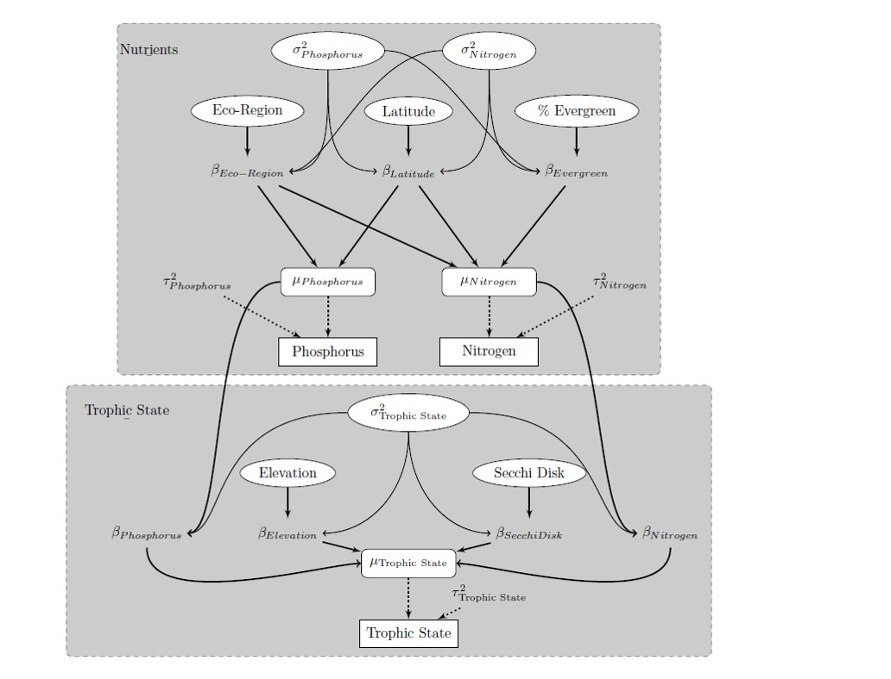</img>
]

---

# Re-thinking the Lake Trophic State Index

.left-column[
- Hierarchical model
  - Nitrogen and Phosphorus
  - POLR: Revised Trophic State Index
- Total Accuracy 
  - 0.6
- Balanced Accuracy
  - 0.68 to 0.78
]

.right-column[
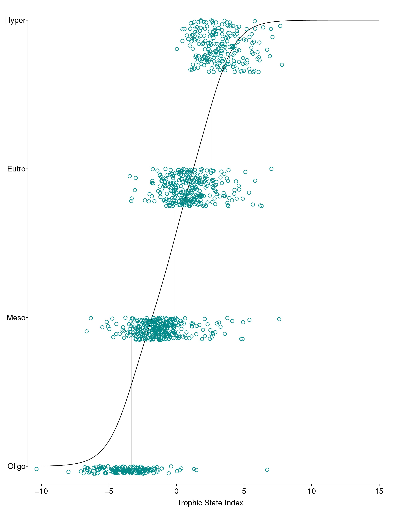
]

---

# Re-thinking the Lake Trophic State Index

- How is it open and reproducible?
    - [GitHub](https://github.com/usepa/rethinking_tsi)
    - [10.5281/zenodo.556175](https://doi.org/10.5281/zenodo.556175)
    - OA (when published)
  
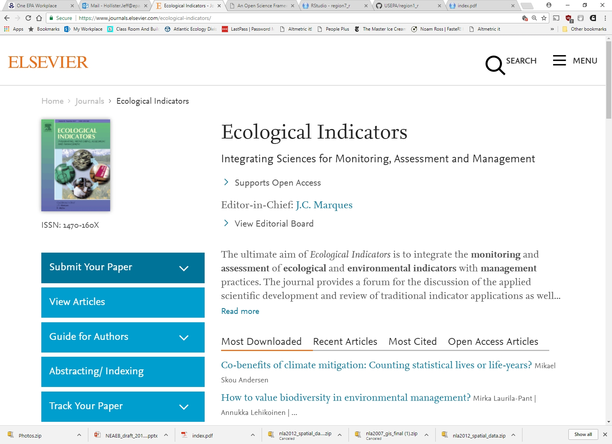
---

# Chlorophyll *a* and microcystin

.left-column[
- National
- Diagnostic tool
- Probability
    - Exceeding microcystin advisory
    - Given chlorophyll *a* concentration
]

.right-column[
</img>
]

---

# Chlorophyll *a* and microcystin

- The numbers!

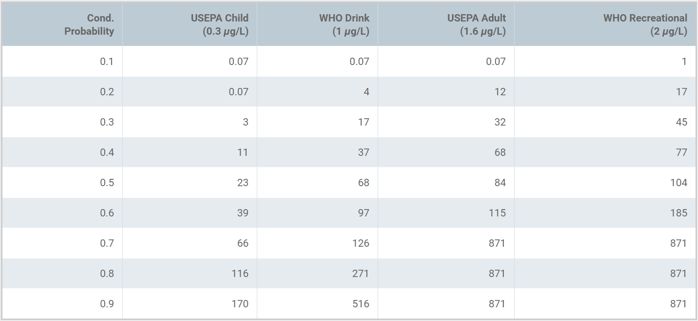

---

# Chlorophyll *a* and microcystin

- How is it open?
    - [GitHub](https://github.com/usepa/microcystinchla)
    - [Zenodo](http://dx.doi.org/10.5281/zenodo.55273)
    - [F1000Research](https://f1000research.com/articles/5-151/v2)
        - Pre-print and peer-reviewed in one!

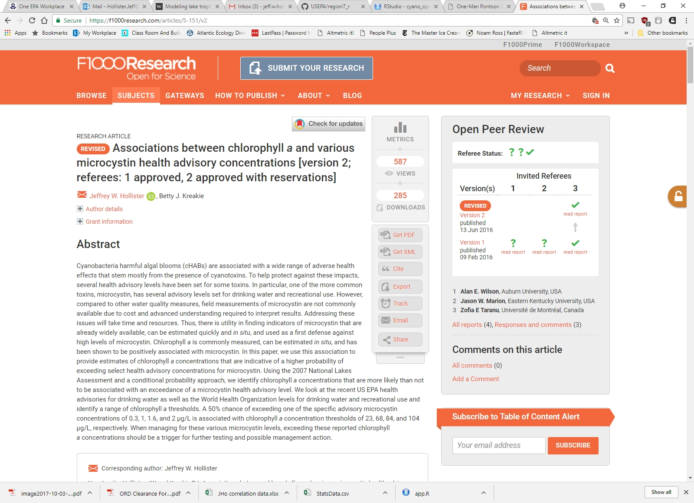

---

# Temporal and spatial dynamics of cyanobacteria blooms

- Led by Stephen Shivers
- Rhode Island
- Field effort
- 2 ponds
    - Yawgoo Pond (the nice wooded site)
    - Warwick Pond (gritty and (somewhat) urban site)
- Twice weekly
- Seven sampling locations in each

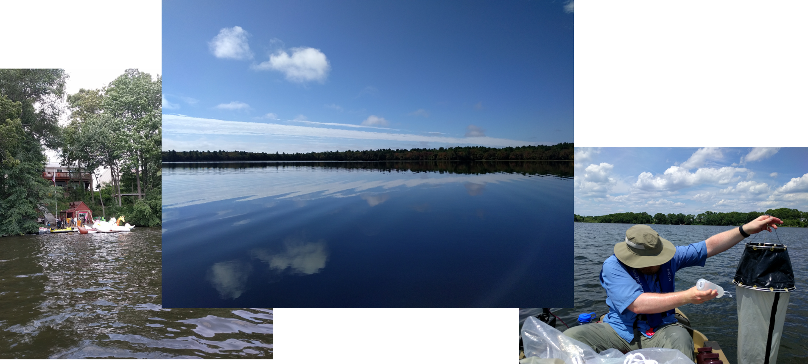</img>

---

# Temporal and spatial dynamics of cyanobacteria blooms

.left-column[
- Measurements
    - Chlorophyll *a*
    - Phycocyanin
    - Microcystin
    - Turbidity
    - Physical profiles
    - Secchi
    - Plankton
    - Nutrients
]

.right-column[
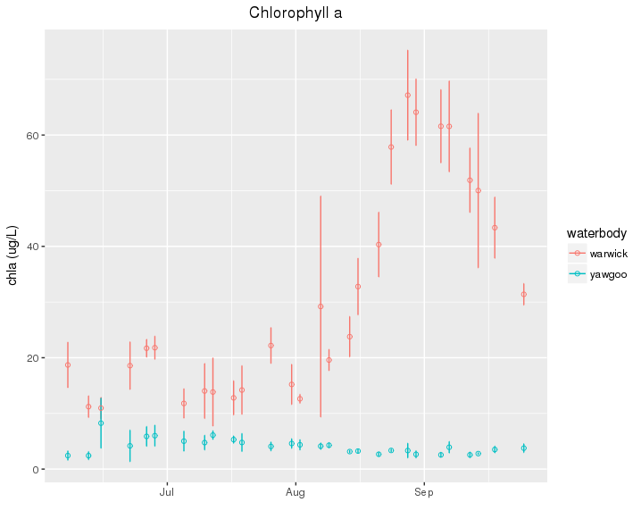</img>
]
---

# Temporal and spatial dynamics of cyanobacteria blooms

- How will it be open?
    - [Private (for now) GitHub]()
    - Zenodo
    - Open Access publications
    - Data publication?
    
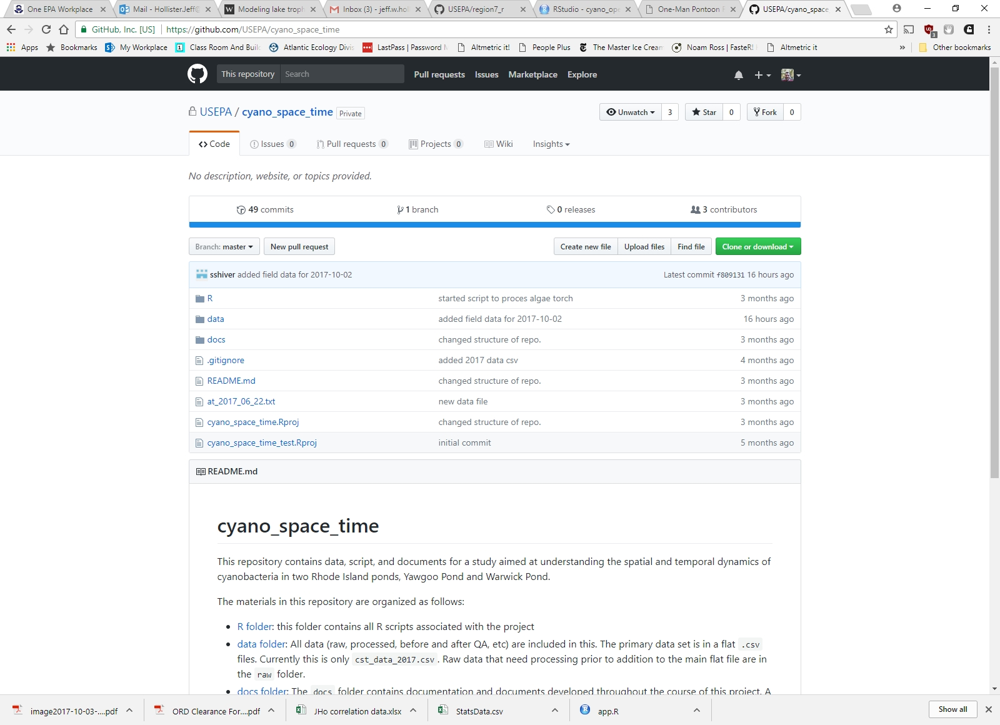

---

# New work

- Hierarchical Bayes models of microcystin
- Lake photic zone temperature
- Phytoplankton community analysis

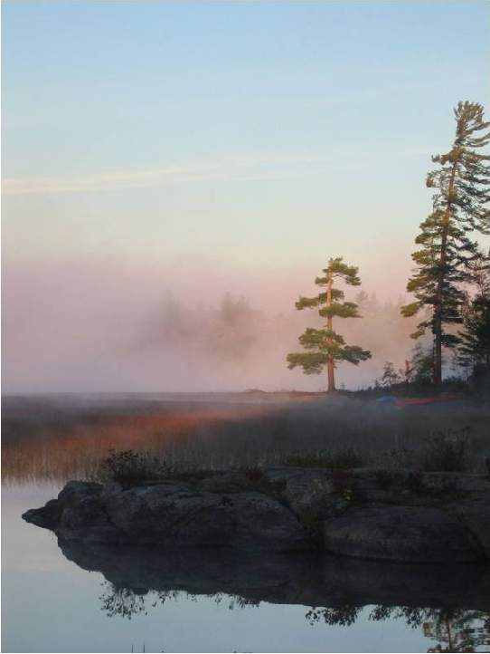</img>

---

# Thanks!
.center[
## Jeff Hollister
US EPA </br>
Atlantic Ecology Division </br>
Narragansett, RI </br>
email: [hollister.jeff@epa.gov](mailto:hollister.jeff@epa.gov) </br>
twitter: [@jhollist](https://twitter.com/jhollist) </br>
github: [jhollist](https://github.com/jhollist) </br>


Slides created via the R package [**xaringan**](https://github.com/yihui/xaringan).
]

